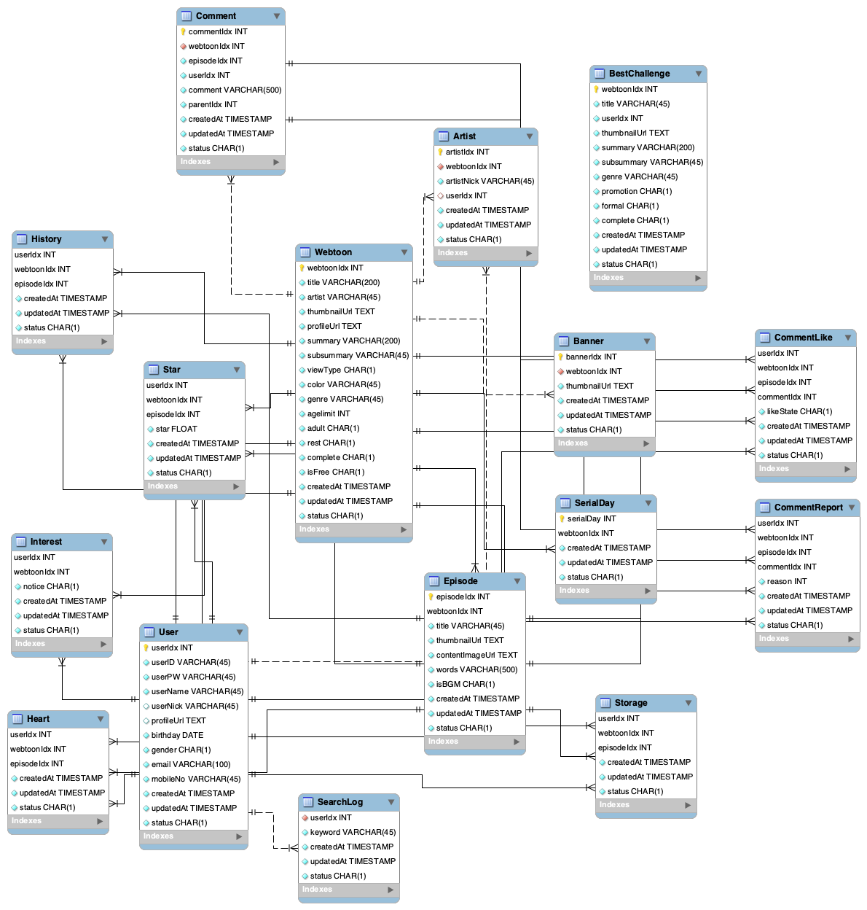
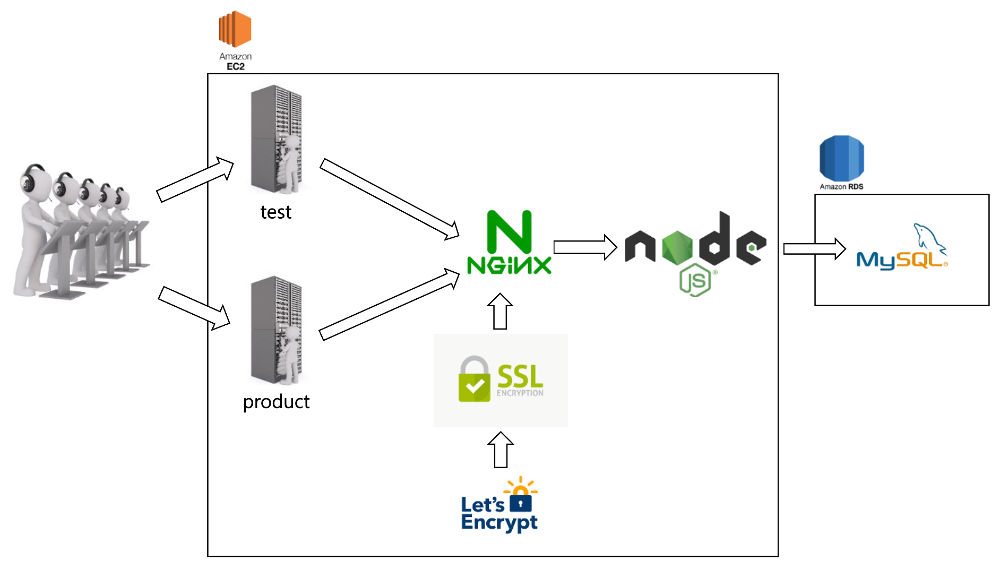

# :star2: naverWebtoon Server clone coding project
- 네이버웹툰 서버 클론 코딩 프로젝트입니다.

### :file_folder: 디렉토리 구조
```bash
📂 config
 ├── 📄baseResponseStatus.js 
 ├── 📄database.js
 ├── 📄email.js
 ├── 📄express.js
 ├── 📄jwtMiddleware.js
 ├── 📄response.js
 ├── 📄secret.js
 ├── 📄winston.js
📂 src
└── 📂 app
    └── 📂 User
          ├── 📄userController.js
          ├── 📄userDao.js
          ├── 📄userProvider.js
          ├── 📄userRoute.js
          ├── 📄userService.js
    └── 📂 Comment
          ├── 📄commentController.js
          ├── 📄commentDao.js
          ├── 📄commentProvider.js
          ├── 📄commentRoute.js
          ├── 📄commentService.js
    └── 📂 Webtoon
          ├── 📄webtoonController.js
          ├── 📄webtoonDao.js
          ├── 📄webtoonProvider.js
          ├── 📄webtoonRoute.js
          ├── 📄webtoonService.js
📄 .gitignore
📄 README.md
📄 index.js
📄 package.json
📄 TemplateExplanation.md
```

### :bar_chart: ERD 설계
- AqueryTool Link: URL : 
- AqueryTool Password : 
- 본 ERD 설계는 실제 네이버웹툰과는 무관합니다



### :exclamation: Role
- :page_with_curl: ERD 설계
- :woman: API 개발
- :computer: AWS EC2, RDS 서버 생성

### :rocket: 사용한 외부 API
- :mailbox: nodeMailer
- :phone: NCP Simple & Easy Notification Service

### :clipboard: Architecture

